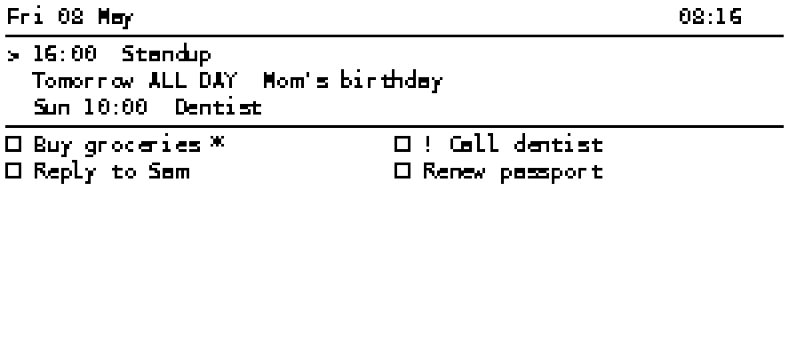

# Calendar Widget — Pico W + e-ink + Android (Termux)

```
[Android phone running Termux + Flask] ←─ home Wi-Fi ─→ [Pico W] ──→ [e-ink]
        ↑
        └─ Google Calendar / iCloud (over Wi-Fi)
```

A calendar/reminders dashboard with two parts:

1. **`server/`** — a tiny Python Flask service running in **Termux** on an
   Android phone. Fetches Google Calendar + Apple Reminders, exposes
   `/widget.json` to the Pico over your home Wi-Fi.
2. **`pico/`** — MicroPython code for a Raspberry Pi Pico W + Waveshare
   Pico-ePaper-2.9. Wakes every 15 min, fetches the JSON, draws it.

## Why Termux on Android

- Free, no cloud account
- Always-on (with wake-lock + battery optimization disabled)
- Real Linux Python — same code as a desktop or Raspberry Pi
- Phone has battery → "free UPS" if Wi-Fi blips or you unplug briefly
- Plenty fast: a 2020+ phone serves this JSON in single-digit ms

## Build order

1. Server: install Termux, run with `--dry-run` to see JSON shape.
2. Add Google + iCloud credentials, confirm real data.
3. Set up auto-start so server survives phone reboots.
4. Reserve the phone's local IP in your router (so it doesn't change).
5. Flash MicroPython on the Pico, copy code, set Wi-Fi + URL.
6. Plug e-ink onto Pico, mount on wall.

## Reminder symbols (constraint: 8x8 ASCII font)

| Display | Meaning |
|---|---|
| `! Call dentist` | overdue |
| `Buy groceries *` | due today |
| `Pick up parcel >` | due tomorrow |
| `Renew passport 12 May` | due on a specific date |
| `Reply to Sam` | no due date |

## Preview



## Layout (296×128, landscape)

```
┌───────────────────────────────────────────────────────────┐
│ Wed 06 May                14:32                            │
├───────────────────────────────────────────────────────────┤
│ > 16:00  Standup                                           │
│   Tomorrow ALL DAY  Mom's birthday                         │
│   Fri 10:00  Dentist                                       │
├───────────────────────────────────────────────────────────┤
│ ☐ Buy groceries *      ☐ ! Call dentist                    │
│ ☐ Reply to Sam         ☐ Renew passport                    │
└───────────────────────────────────────────────────────────┘
```
